Projekt został zrealizowany w ramach zajęć Grafika Komputerowa odbywających się na semestrze szóstym dla kierunku Informatyka Stosowana na Wydziale Elektrycznym Politechniki Warszawskiej.

## Temat Projektu
Tematem projektu jest zbadanie problemu odbijania światła od obiektów trójwymiarowych, które jest emitowane przez źródła światła.

## Technologia
Projekt został wykonany przy użyciu języka C# oraz biblioteki AvaloniaUI tworzącej okno aplikacji.

## Sposób wykonania
Obiektem na scenie została kula. Do realizacji zadania został użyty model odbicia Phonga prezentowany na wykładzie. Zdefiniowane zostały różne materiały, a sama zmiana materiały dostępna jest pod przyciskiem. Ponadto możliwe jest przesuwanie zarówno kamerą, jak i światłem w każdym wymiarze. Zdefiniowane zostały także dwa tryby kuli - kula jako wielościan złożony z trójkątów oraz wygładzona kula.

## Materiały
Zaimplementowane zostało 24 materiałów: \[ brąz, szmaragd, jadeit, obsydian, perła, rubin, turkus, mosiądz, chrom, miedź, złoto, srebro, czarny plastik, cyjanowy plastik, zielony plastik, czerwony plastik, biały plastik, żółty plastik, czarna guma, cyjanowa guma, zielona guma, czerwona guma, biała guma, żółta guma\]. Wykorzystane zostały współczynniki zawarte pod [linkiem](http://devernay.free.fr/cours/opengl/materials.html?fbclid=IwAR3eddVB_7gswZDjj4zyaC2RufFHkjhc1dEt0brysAKraRCfuT_8trHGwHE). 

Poniższe zrzuty ekranu z przykładowymi materiałami i domyślnie padającym światłem:
|                                  |     |
| -------------------------------- | --- |
| 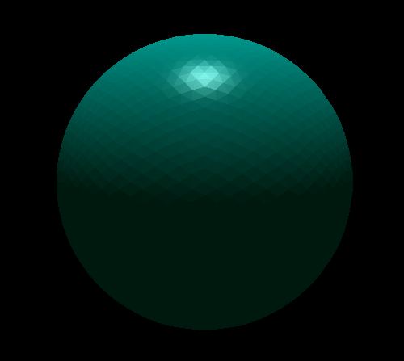 |  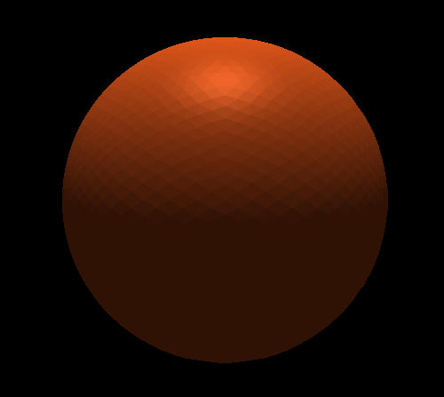   |
| Plastik o kolorze cyjanu         |  Miedź   |
| 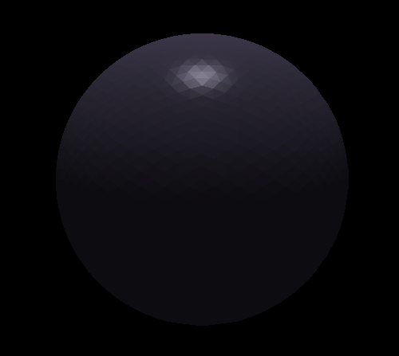 | 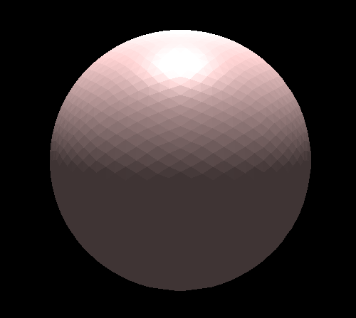 |
| Obsydian | Perła |
| 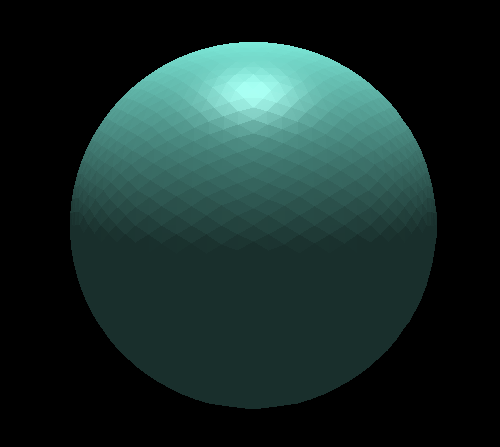 | 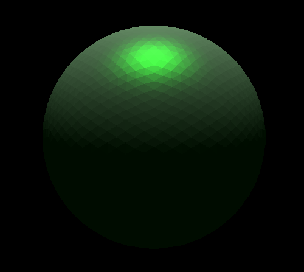 |
| Turkus | Guma o kolorze zielonym |
| 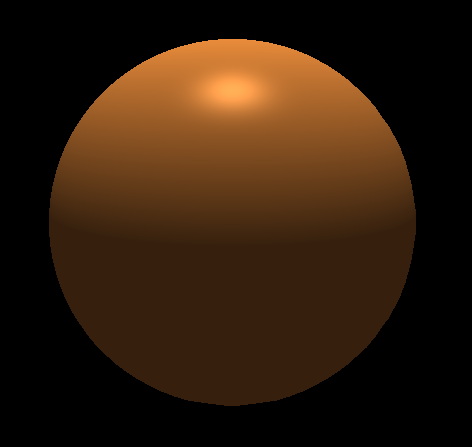 | 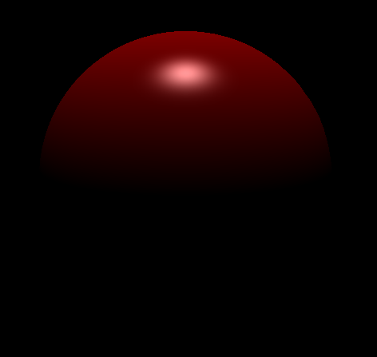 |
| Brąz | Plastik o kolorze czerwonym|
| 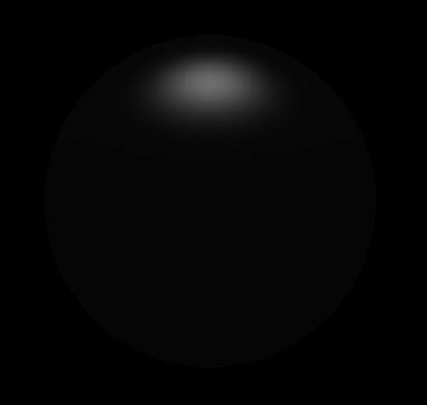 | 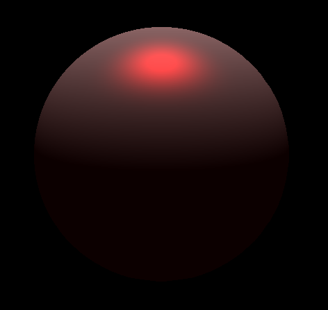|
| Guma o kolorze czarnym | Guma o kolorze czerwonym |
| 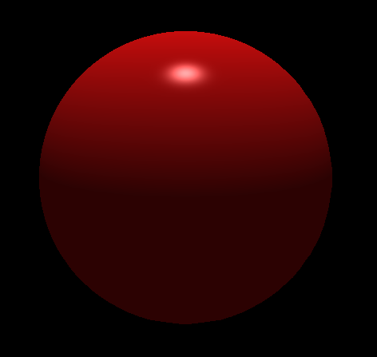 | 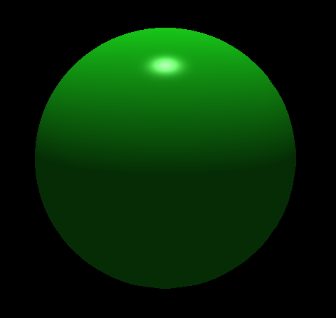 | 
| Rubin | Szmaragd |


## Światło
W programie zostało wykorzystane domyślne światło białe, którym można sterować. Dodana została również możliwość umieszczenia większej liczby źródeł światła w dowolnym miejscu sceny o dowolnym kolorze. Aby jednak to uczynić, należy zdefiniować te źródła w kodzie. Poniżej znajdują się wizualne przykłady.

| | |
| -- | -- |
| 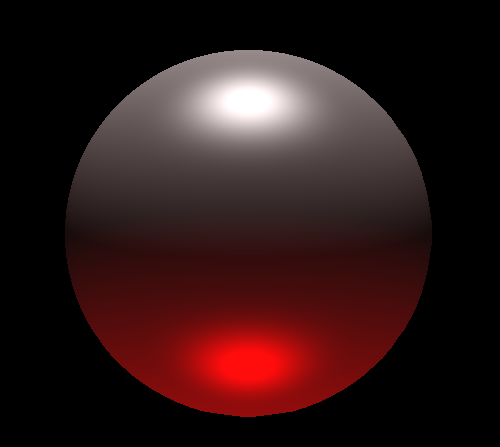 | 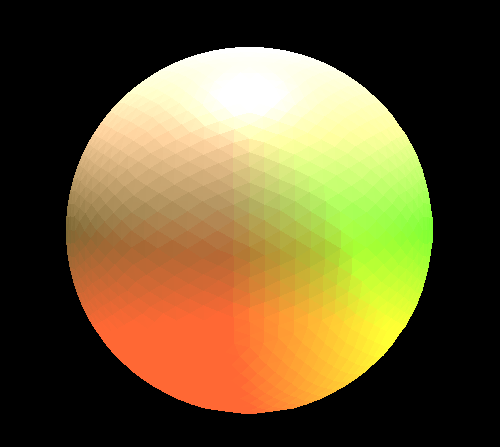 |
| "Patriotyczna Kula" - biała guma, białe światło od góry, czerwone od dołu | Kula perłowa i trzy źródła światła - czerwone od dołu, białe od góry, zielone z prawej strony |

## Sterowanie
| Przemieszczanie obserwatora | Przypisany klawisz | 
| --- | --- |
| Do przodu | W |
| Do tyłu | S |
| W prawo | D |
| W lewo | A |
| Do góry | U |
| W dół | I |

| Obracanie obserwatora | Przypisany klawisz |
| --- | --- |
| W prawo | E |
| W lewo | Q |
| W górę | K |
| W dół | J |
| Zgodnie ze wskazówkami zegara | L |
| Przeciwnie do wskazówek zegara | H |

| Przybliżanie i oddalanie | Przypisany klawisz |
| --- | --- |
| Przybliżenie | = |
| Oddalenie | - |

| Przemieszczanie światła | Przypisany klawisz |
| --- | --- |
| W prawo | Z |
| W lewo | X |
| Do góry | C |
| W dół | V |
| Do przodu | B |
| Do tyłu | N |

|Inne operacje | Przypisany klawisz |
| --- | --- |
| Zmiana materiału | M |
| Przełączanie pomiędzy trybem wielościanu, a kuli | / |

## Uruchomienie
Znajdując się w folderze głównym projektu należy wykonać następujące polecenie:
```dotnet
dotnet run --project guiProject/guiProject.Desktop
```

## Autorzy
- Jakub Maciejewski
- Michał Ziober